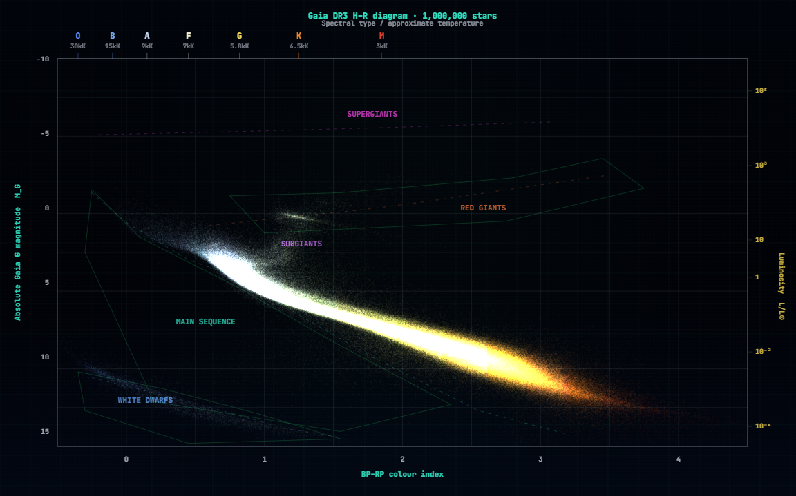

# Gaia Galactic Explorer & H–R Engine

[](https://biswajit1999.github.io/interactive-hr-diagram-lab/)


A real-data browser laboratory for exploring nearby Gaia DR3 stars as a **Hertzsprung–Russell diagram** and a **local Galactic point-cloud projection**.

This project is designed as a scientific portfolio tool: visually polished enough for public presentation, but still grounded in real catalogue data, real parallax distances, and transparent calculations.

**Live demo:**  
https://biswajit1999.github.io/interactive-hr-diagram-lab/

---

## Preview



---

## What is this?

The H–R diagram is one of the most important plots in astronomy. It shows how stars are distributed by colour and brightness, revealing the **main sequence**, **giants**, **supergiants**, and **white dwarfs**.

This app loads real stars from the **Gaia DR3 catalogue**, calculates their distances and absolute magnitudes, and plots them interactively in the browser.

In simple terms:

- blue stars are generally hotter
- red stars are generally cooler
- brighter stars appear higher on the diagram
- the Sun is marked for reference
- the dense diagonal band is the main sequence, where most stars spend most of their lives

---

## Why this project matters

Many H–R diagram examples online use static images or randomly generated points. This project instead uses real Gaia catalogue rows and turns them into an interactive laboratory.

It is useful for:

- students learning stellar evolution
- astronomy outreach and teaching
- portfolio demonstration of scientific web development
- experimenting with catalogue data pipelines
- visualising how real stars occupy different regions of the H–R diagram

---

## Key features

- Real Gaia DR3 catalogue rows
- 2D H–R diagram view
- 3D local Galactic projection mode
- Sun marker at **BP–RP ≈ 0.82** and **M_G ≈ 4.67**
- Stellar-region overlays:
  - Main sequence
  - Giants
  - Supergiants
  - White dwarfs
- Multiple rendering templates:
  - Gaia stellar colours
  - Classic textbook style
  - Density glow
  - Research monochrome
- Luminosity side axis
- Live telemetry console:
  - rows parsed
  - accepted stars
  - rejected rows
  - loading speed
  - elapsed time
  - estimated remaining time
- PNG export for saving the current view
- GitHub Pages compatible frontend
- No synthetic fallback star data

---

## Data source

This app uses the ESA Gaia DR3 archive through TAP/ADQL queries.

The browser-side query retrieves:

```sql
SELECT TOP N ra, dec, parallax, bp_rp, phot_g_mean_mag
FROM gaiadr3.gaia_source
WHERE parallax > 2
AND parallax_over_error > 20
AND bp_rp IS NOT NULL
AND phot_g_mean_mag IS NOT NULL
```

For larger modes, the app splits the request into smaller **RA sky slices**, for example:

```sql
AND ra >= 0
AND ra < 72
```

This avoids requesting one very large CSV file at once.

---

## Scientific calculations

### Distance from parallax

Gaia parallax is measured in milliarcseconds. The app converts parallax into distance using:

```text
distance_pc = 1000 / parallax_mas
```

### Absolute Gaia G magnitude

The apparent Gaia G magnitude is converted into absolute magnitude:

```text
M_G = phot_g_mean_mag + 5 + 5 log10(parallax_mas / 1000)
```

### 3D local projection

For the Galactic projection mode, RA, Dec, and distance are converted into Cartesian coordinates:

```text
x = d cos(dec) cos(ra)
y = d cos(dec) sin(ra)
z = d sin(dec)
```

This is a local spatial projection, not a full Milky Way simulation.

---

## Why 50k failed before

The first GitHub Pages version tried to download 50,000 Gaia rows as one large CSV through a public CORS bridge. That could trigger:

- browser `Failed to fetch` errors
- HTTP 413 payload errors
- public proxy rate limits
- Gaia TAP timeout or response-size issues

The current version is safer because it requests data in smaller chunks. For example, 50k mode is split into several 10k-style catalogue slices rather than one huge request.

For very large modes such as **250k** or **1M**, a proper server-side proxy is still recommended.

---

## Browser limitations

This repository is intentionally lightweight and can run from GitHub Pages, but GitHub Pages is a static host. It cannot run backend code.

The frontend tries browser-safe Gaia requests using public fallback routes, but those external services can fail or rate-limit. If that happens, the app is not generating fake data; it is simply unable to reach Gaia through the browser route.

For reliable large-scale use, deploy a small backend proxy.

Recommended architecture for heavy mode:

```text
Browser UI
   ↓
Your backend /api/gaia proxy
   ↓
ESA Gaia TAP service
   ↓
CSV or cached binary response
   ↓
Web Worker parser
   ↓
Float32Array buffers
   ↓
Canvas/WebGL renderer
```

---

## How to use

1. Open the live demo.
2. Start with **10,000 rows**.
3. Click **Initialize Gaia Datastream**.
4. Wait for the console to show that the Gaia buffers are ready.
5. Switch between:
   - **2D H–R Plot**
   - **3D Galactic Map**
6. Try different colour templates and overlay modes.
7. Use the PNG export button to save the current view.

---

## Recommended testing order

Start small:

```text
10,000 rows → 50,000 rows → 100,000 rows
```

If 10k works but 50k fails, the issue is likely the public CORS route, not the plotting code.

---

## Repository structure

Upload these files to the repository root for GitHub Pages:

```text
index.html
styles.css
gaia-api.js
README.md
LICENSE
.nojekyll
images/
```

Example:

```text
interactive-hr-diagram-lab/
├── index.html
├── styles.css
├── gaia-api.js
├── README.md
├── LICENSE
├── .nojekyll
└── images/
    ├── classic-hr-reference.png
    └── textbook-hr-reference.jpg
```

---

## Deploy on GitHub Pages

1. Make the repository public.
2. Go to:

```text
Settings → Pages
```

3. Select:

```text
Deploy from a branch
Branch: main
Folder: /root
```

4. Save and wait for GitHub Pages to deploy.

The site will be available at:

```text
https://biswajit1999.github.io/interactive-hr-diagram-lab/
```

---

## Notes for future development

Possible future improvements:

- server-side Gaia proxy for reliable 50k–1M operation
- cached binary catalogue chunks
- WebGL point-cloud renderer
- shader-based colour mapping
- proper Galactic-coordinate transformation
- search/highlight for known stars
- selectable Gaia quality cuts
- exportable CSV subset
- educational mode with guided explanations

---

## Offline Python plotting

Users who prefer working with downloaded Gaia CSV files can reproduce the H–R diagram locally.

1. Run the ADQL query in `queries/gaia_hr_query_10k.adql`.
2. Download the result as CSV.
3. Save it as:

```text
data/gaia_sample.csv
```

## Acknowledgements

This project uses data from the **European Space Agency Gaia mission** and the **Gaia Data Processing and Analysis Consortium (DPAC)**.

Created by **Biswajit Jana** as part of an academic and scientific computing portfolio.


---

## License and reuse

© 2026 Biswajit Jana.

Code may be reused or modified with credit.  
Gaia catalogue data belongs to the original Gaia mission/archive sources.  
Visual design, text, and project presentation should not be copied without attribution.
